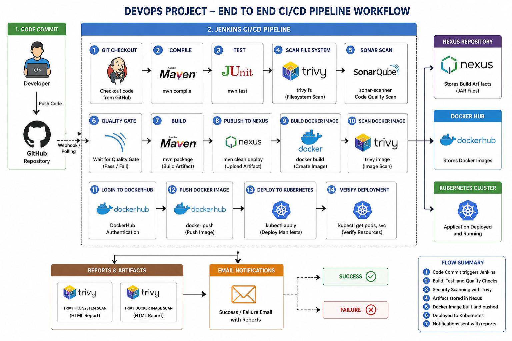
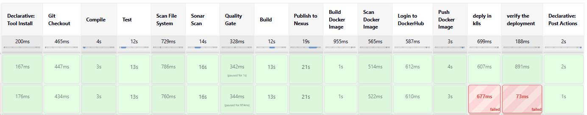

# 🚀 End-to-End DevOps CI/CD Pipeline (Jenkins + Docker + Nexus + SonarQube + Kubernetes)

  

------------------------------------------------------------------------

## 📌 Project Description

This project demonstrates a **complete DevOps CI/CD pipeline** that
automates build, testing, security scanning, artifact management,
containerization, and Kubernetes deployment using Jenkins.

------------------------------------------------------------------------

## 🔄 CI/CD Pipeline Flow

1.  Code pushed to GitHub\
2.  Jenkins triggers pipeline\
3.  Maven build & test\
4.  Trivy filesystem scan\
5.  SonarQube analysis\
6.  Quality Gate check\
7.  Artifact upload to Nexus\
8.  Docker image build\
9.  Trivy Docker scan\
10. Push image to DockerHub\
11. Deploy to Kubernetes\
12. Verify deployment\
13. Email notification

------------------------------------------------------------------------

## 🧰 Tech Stack

-   Jenkins
-   Maven
-   SonarQube
-   Nexus
-   Docker
-   Trivy
-   Kubernetes
-   GitHub

------------------------------------------------------------------------

## 🔐 Credentials Setup (Jenkins)

-   **docker1027** → DockerHub (username + token)
-   **k8s** → Kubernetes config
-   **maven-settings** → Nexus credentials

------------------------------------------------------------------------

## ⚙️ Pipeline Stages

### Git Checkout

``` bash
git clone <repo>
```

### Build & Test

``` bash
mvn clean install
```

### Security Scan

``` bash
trivy fs .
trivy image <image>
```

### SonarQube

``` bash
sonar-scanner
```

### Docker

``` bash
docker build -t prajwal1027/database-app .
docker push prajwal1027/database-app
```

### Kubernetes

``` bash
kubectl apply -f deployment-service.yml -n appr
kubectl get pods -n appr
kubectl get svc -n appr
```

------------------------------------------------------------------------

## 📊 Output

-   Nexus artifact stored\
-   Docker image pushed\
-   Kubernetes deployment running\
-   Trivy reports generated

------------------------------------------------------------------------

## 📧 Notifications

Email sent on success/failure with scan report.

------------------------------------------------------------------------

## 👨‍💻 Author

Prajwal B
